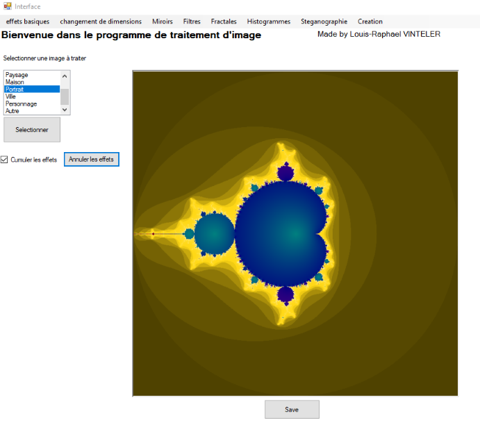
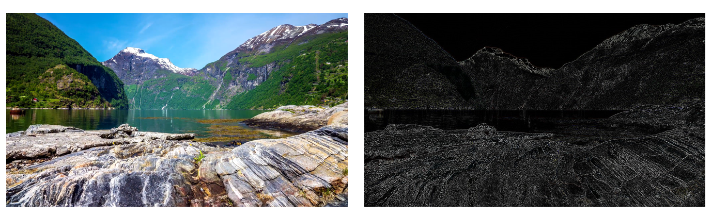
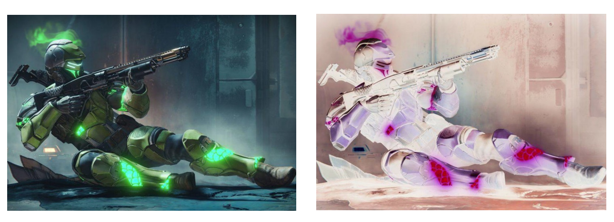
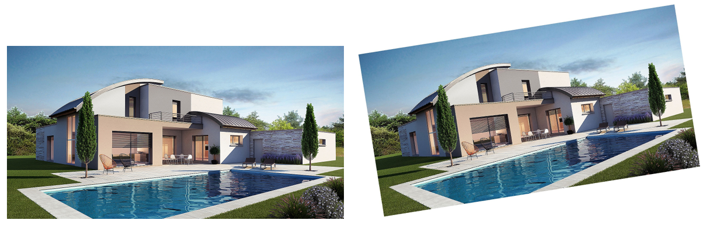
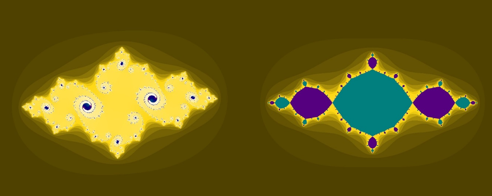
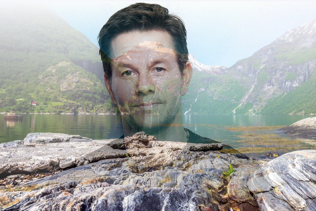
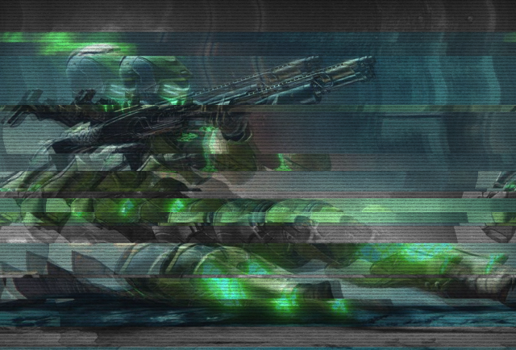

# Image_processing_app

## Abstrait

## Exemples de traitements 

### Filtres 

Application de filtres via opérations de convolutions : 

- Flou
- Détection de contours
- Renforcement de bords
- Repoussage
- Contraste
- Négatif
- ...

### Retraitements

Méthodes de retraitements via méthodes d'interpolations : 

- Miroir vertical/horizontal
- Kaleidoscope
- Redimensionnement
- Rotation

## Fractales : 

Génération de fractales via résolution d'équations dans le plan complexe C

## Créations originales : 

- Steganographies : encoding et decoding d'images
- Fondu
- Effets "glitch"
- Histogramme RGB
- ...

